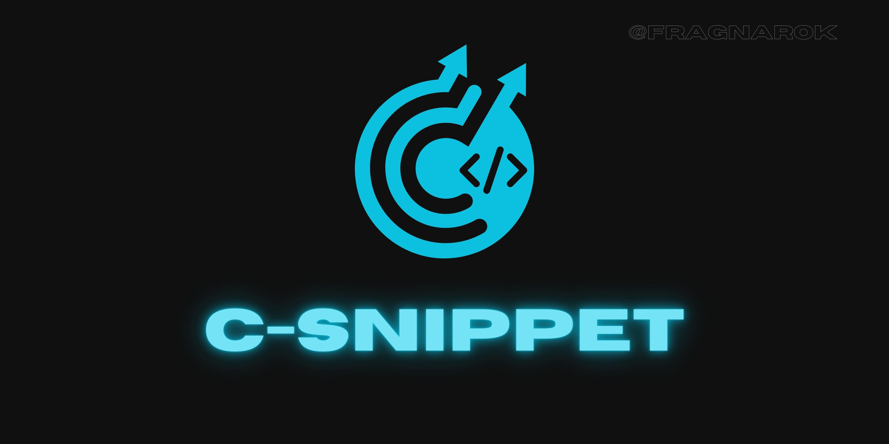

# C-Snippet

**Convert snippets from any code editor**

[](https://www.npmjs.com/package/c-snippet)
[](https://www.npmjs.com/package/c-snippet)
[](LICENSE)




## 🚀 Description

C-Snippet is a TypeScript-based tool that allows you to convert snippets from one code editor's format to another. It provides a command-line interface (CLI) for converting and saving snippets to the desired output format.

## 📦 Installation

To install C-Snippet, you can use npm:

```bash
npm install -g c-snippet
```

## 💡 Usage

After installation, you can use the `c-snippet` command to run the tool. The CLI will guide you through the conversion process by asking you a series of questions. Here's how to use it:

```bash
c-snippet
``` 

Follow the prompts to select the source editor, target editor(s), input snippets, and output path. C-Snippet will then parse, convert, and save the snippets accordingly.

## 📜 Scripts

- `npm start`: Build and run the tool in a single command.
- `npm run start:linux`: Same as `npm start`, but for Linux users (clears terminal before running).
- `npm run build`: Compile TypeScript code.
- `npm test`: Run Jest tests.
- `npm run repo:commit`: Stage, commit, and push changes to the repository.

## 🤝 Contributing

Contributions to C-Snippet are welcome! If you find a bug, have a feature request, or want to contribute code, please open an issue or submit a pull request on the GitHub repository.

## 📄 License

This project is licensed under the MIT License - see the LICENSE file for details.

---

<h3 align="center" style="color: gray">@FragnaroK</h3>

---

## Instructions for Generated Snippet Files 📝✂️

### Visual Studio Code 👓

1. Open the editor and select:

         File > Preferences (Code > Preferences on macOS)


2. Choose the option: **"New global snippets file"**

3. Copy all the snippets from the generated file into the newly opened VS Code snippets file.

4. Save, close VS Code, and you're all set! ✨

### Atom 🚀

1. Open Atom and navigate to:

        File > Snippets


2. This will open Atom's snippets file. Copy the generated snippets into that file.

> *If you want to add snippets from different languages in the same file, separate them like this:*

```javascript
// GLOBAL 
'*':
    'nameSnippets':
        'prefix': 'snip' (trigger)
        'body': '<tag> code </tag>'
    'nameSnippets':
        'prefix': 'snip' (trigger)
        'body': '$(document).someFunction({})'
// HTML
'.text.html.basic':
    // ...
// CSS
'.text.css':
    // ...
```
### Sublime Text 📄
1. Open Sublime:

    - You can save the generated snippets folder to your Packages/User folder and then reload Sublime Text.
    - To find Packages/User, follow these paths for different versions:

    ##### Sublime 2

        - Windows: %APPDATA%\Sublime Text 2
        - OS X: ~/Library/Application Support/Sublime - Text 2
        - Linux: ~/.config/sublime-text-2

    ##### Sublime 3

        - Windows: %APPDATA%\Sublime Text 3
        - OS X: ~/Library/Application Support/Sublime - Text 3
        - Linux: ~/.config/sublime-text-3

    ##### Sublime 4

        - Windows: %APPDATA%\Sublime Text
        - OS X: ~/Library/Application Support/Sublime Text
        - Linux: ~/.config/sublime-text 

2. Copy the folder


### Dreamweaver ☁️

1. Locate the Dreamweaver folder:

        C:\Users\%USERNAME%\AppData\Roaming\Adobe\Dreamweaver

> You may find folders from different versions. Look for the folder "en_US" or your language folder. Then go to "Configuration/snippets". Copy the folder with the generated snippets into this location.

2. After copying the generated snippets folder (DO NOT change the folder name, as triggers may not work), copy the "dwSnippets.json" file into the snippets folder (not the generated one), as it contains triggers for all snippets.

***If a "dwSnippets.json" file already exists, DO NOT DELETE IT. Copy the added content into that file. Pay attention to the object structure.***

---
